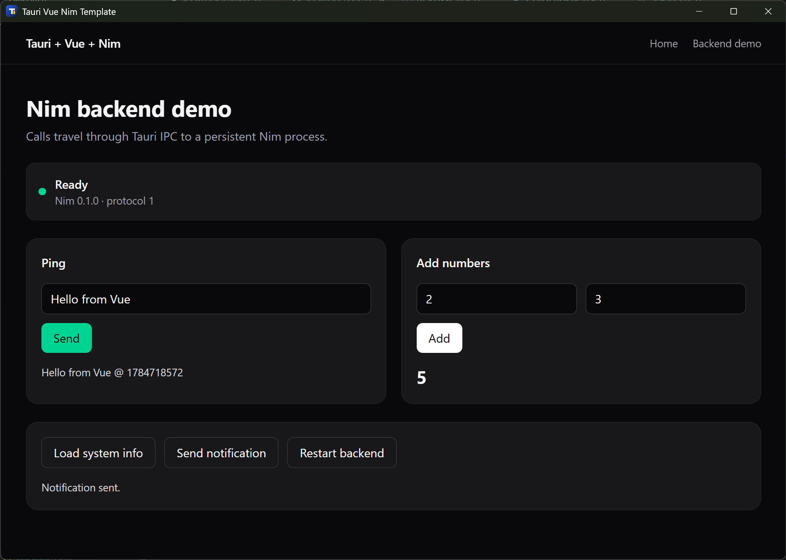

# Tauri with Nim sidecar Template




This is an app using Vue 3, Vite, Bun, Vue Router, Pinia,
Tailwind CSS, Tauri v2, and a persistent Nim backend to demonstrate the ability of using Nim as a backend for Tauri

## Architecture

```text
Vue -> Tauri invoke -> Rust sidecar manager -> Nim stdin
Vue <- command result <- JSON correlation <- Nim stdout
```

The Nim process uses one JSON object per line. stdout is reserved for protocol
messages, while stderr is reserved for logs.

## Requirements

- Bun
- Rust stable
- Nim 2.x
- Tauri's platform prerequisites

Linux additionally requires the WebKitGTK and AppIndicator development packages
listed in `.github/workflows/ci.yml`.

## Development

```bash
bun install
bun run tauri:dev
```

`tauri:dev` first compiles the Nim backend into the target-triple filename
required by Tauri, then starts Vite and the desktop application.

For a beginner-friendly explanation of the Vue → Rust/Tauri → Nim message flow
and a complete example of adding a Nim method, read [GUIDEBOOK.md](GUIDEBOOK.md).

## Builds

`bun build` invokes Bun's JavaScript bundler directly; it does not run the
scripts in `package.json`. Use `bun run` for repository scripts:

```bash
# Build a debug Tauri executable without creating installers.
bun run build:dev

# Build release installers/bundles.
bun run build:release

# Build the optimized executable without invoking WiX/installer packaging.
bun run build:release:binary

# Alias for the release build.
bun run build
```

The debug executable is written under `src-tauri/target/debug`. Release
artifacts are written under `src-tauri/target/release/bundle`.

## Supported platforms

This template officially supports native x64 builds for:

- Windows: `x86_64-pc-windows-msvc`
- Linux: `x86_64-unknown-linux-gnu`

The Nim sidecar build script deliberately rejects macOS and ARM targets. Build
on the target operating system (or its CI runner), rather than attempting to
cross-compile the sidecar from Windows. To add another platform, extend the
supported-target list in `scripts/build-sidecar.ts`, provide its Nim toolchain,
and add a matching CI build.

## Production build

```bash
bun run tauri:build
```

Generated installers are under `src-tauri/target/release/bundle`.

## Useful commands

```bash
bun run typecheck
bun run test:nim
bun run build:sidecar
bun run test:sidecar
cargo test --manifest-path src-tauri/Cargo.toml
bun run format:check
```

## Adding a Nim method

1. Add a new `case` branch in `backend-nim/src/dispatcher.nim`.
2. Validate `request.params`.
3. Return `successResponse` or `errorResponse`.
4. Add TypeScript parameter/result types in `src/api/backend.types.ts`.
5. Add a typed wrapper in `src/api/backend.ts`.
6. Add Nim and frontend tests.

For a larger app, move each feature into `backend-nim/src/methods/` and have the
dispatcher delegate to those modules.

## External HTTP requests

Use `src/api/fetch.ts` for real HTTP APIs. Calls to the local Nim backend must use
the typed Tauri wrappers in `src/api/backend.ts`.

## Sidecar filenames

The build script creates:

- `nim-backend-x86_64-pc-windows-msvc.exe`
- `nim-backend-x86_64-unknown-linux-gnu`

The base name in `tauri.conf.json` remains `binaries/nim-backend`.

## Protocol

Request:

```json
{ "id": "request-1", "method": "ping", "params": { "message": "hello" } }
```

Response:

```json
{ "id": "request-1", "ok": true, "result": { "message": "hello", "timestamp": 123 } }
```

Backend event:

```json
{ "event": "backend.ready", "data": { "protocolVersion": 1, "backendVersion": "0.1.0" } }
```

## Security

The Vue webview cannot execute arbitrary shell commands. Only the Rust layer
starts the configured sidecar. The capability file grants `core:default` and
does not expose shell permissions to JavaScript.

Review and tighten the CSP before adding remote API domains.

## GitHub releases

Push a tag such as:

```bash
git tag v0.1.0
git push origin v0.1.0
```

The release workflow builds native Windows and Linux packages and creates a
draft GitHub Release.

## Template checklist

After creating a repository from this template:

1. Change `productName` and `identifier` in `src-tauri/tauri.conf.json`.
2. Change package names in `package.json` and `src-tauri/Cargo.toml`.
3. Replace the demo methods and views.
4. Commit the generated `bun.lock` and `src-tauri/Cargo.lock`.
5. Enable GitHub's **Template repository** setting.

## Conclusion

Q: Why can't you just use Rust for the backend?

A: Nim

Further reading: [GUIDEBOOK](GUIDEBOOK.md)
